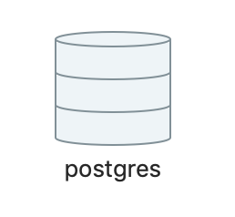
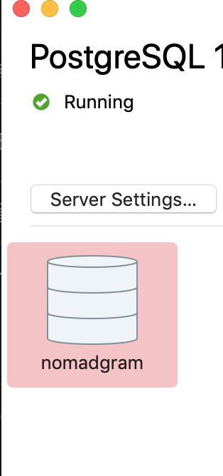
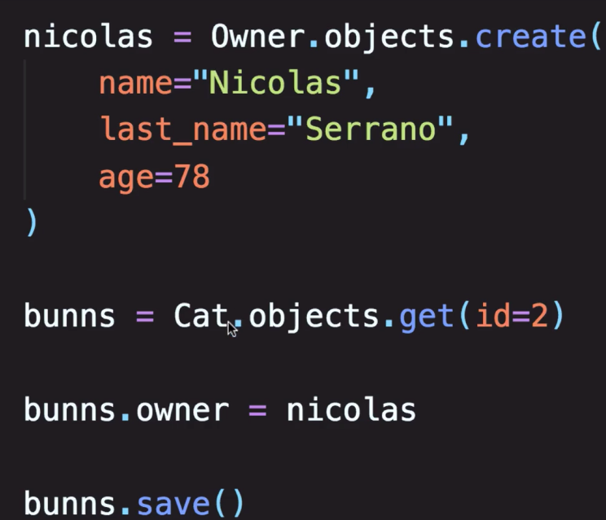
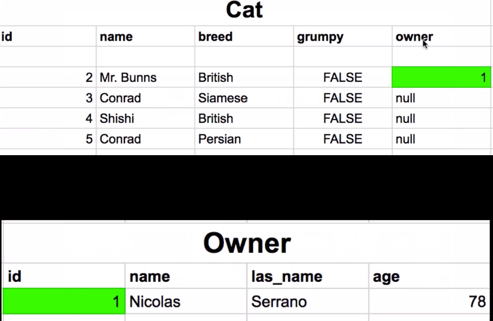
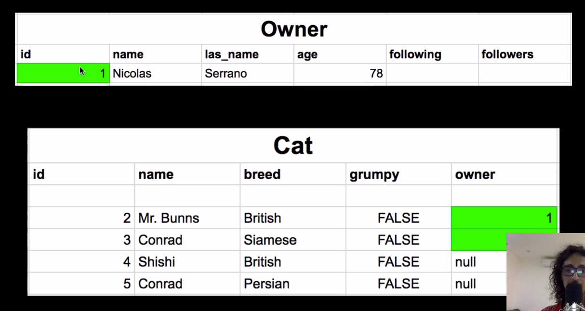
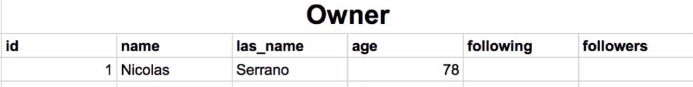
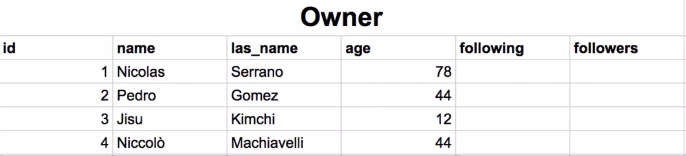
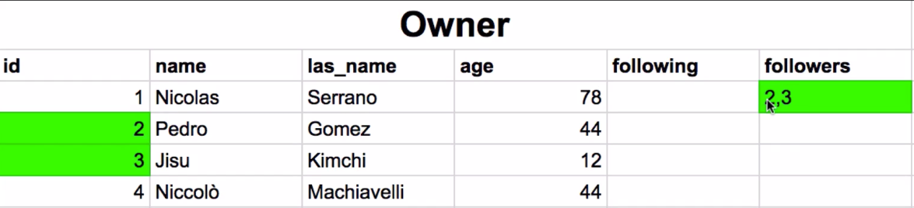

## 1. How does a backend Work?


* 백엔드가 동작하는 과정
  1. 브라우져에서 서버로 프로필을 요청한다.
  2. 서버는 해당 요청을 받고, 데이터베이스로 부터, 해당하는 정보를 받는다.
  3. 이때 받는 정보는 쿼리셋의 형태로 전달되고, 브라우져가 알아들을 수 있도록하기 위해서, Serialize 한다.
  4. 여기서 Serialize는 데이터베이스로 부터 받은 QuerySet을 JSON으로 바꾸는 것이다.
  5. 요청한 프로필에 대해서 JSON Object로 응답 값을 받는다.


## 2. Intro duction to Django

* Django is a framework
* 생산성이 좋다.


## 3. What is an virtual environment

* pipenv
*  프로젝트에 대한 개발환경을 독립적으로 유지하기 위해서 사용한다.


## 4. Creating a VirtualEnvironment

```shell
#pipenv 설치
brew install pipenv

#새로운 버블 pipenv 3 생성
pipenv --three

#pipenv에 라이브러리 추가
pipenv install requests

#pipenv 실행
pipenv shell
```


## 5. Parts of Django-Settings, Urls, Apps

* Settings
  * 장고의 행동방식을 커스터마이징 할 수 있다.
  * 타임존, 언어 설정 등등
* URLS
  * 외부에서 장고 서버에 요청을 보낼 때, url을 기준으로 보내게 되고, 해당 url이 호출되면, 매치되는 view function이 호출된다.
* Apps
  * 앱은 최대한 작게


## 6. Creating our Django Project

 ```shell
#쿠키커터 설치
pip3 install cookiecutter

#쿠키커터 실행 및 프로젝트 세팅
cookiecutter https://github.com/pydanny/cookiecutter-django
 ```


## 7. Creating the GitHub Repository

```shell
git remote add origin {Github repo}

git pull origin master
```


## 8. Installing the requirements

```shell
pipenv --three
pipenv install -r local.txt
pipenv shell
```


## 9. Production settings and local settings

* local setting and production setting
  * Base + local
  * base + production
  * 글로벌한 설정은 base에 들어간다.


## 10. Databases and Django

> 장고에서는 여러가지 디비를 사용할 수 있다. 원하는거 사용하자.


## 11. Creating the Databases

* pgadmin을 설치한다.
  * https://postgresapp.com/



* 이걸 클릭하고, 쉘이 뜨면,

  ```shell
  CREATE DATABASE nomadgram;
  ```

  * 을 적어준다.

  ```python
  DATABASES = {
      'default': env.db('DATABASE_URL', default='postgres:///nomadgram'),
  }
  ```

  * setting 상의 db설정이 위와같이 되어있고, nomadgram db를 생성하면, 여기에 적힌대로 매칭이 되고, 서버를 실행할 수 있게된다.

  


## 12. Creating the Apps


```shell
cd nomadgram
django-admin startapp images
```

* images 앱을 생성 한 후, base.py에 등록해준다.


```python
#images/apps.py
from django.apps import AppConfig

class ImagesConfig(AppConfig):
    name = 'nomadgram.images'
```


```python
#base.py

LOCAL_APPS = [
    'nomadgram.users.apps.UsersAppConfig',
    'nomadgram.images.apps.ImagesConfig'
]
```

* 위와 같이 앱을 등록한다.


# 13. Parts of a Django App-Models and Views

* Django APP
  * models
  * urls
    * 장고의 url은 전체 어플리케이션에서 모든 url을 가져온다.
    * 이 urls는 어플리케이션의 urls 이다
  * views
    * url에 매핑되는 views에 있는 함수가 실행된다.
    * 해당 함수는 모델과 커뮤니케이션 하면서, 요청에 해당하는 쿼리셋 객체를 리턴한다.


## 14. What is the Django ORM?

* ORM

  * sql과 django 사이에 통역사 역할을 한다.

  ```python
  #QuerySet
  User.objects.filter(country="colombia").order_by('created_date')
  
  #Query
  SELECT * FROM users WHERE country="colombia" ORDER BY created_date
  ```

* python으로 코드를 짰을 때, 해당하는 SQL 쿼리를 생성하여서, DB에 쿼리한다.


## 15. Recap-Class Inheritance

```python
#코드가 중복된다.
class Cat():
    legs = 4
    eyes = 2
    nose = 1
    
class BritishCat():
    legs = 4
    eyes = 4
    nose = 1
    breed = 'british'   
    
# 더 상위 개념인 Cat을 상속한다.

class BritishCat(Cat):
    breed = 'british'
    
    
BritishCat.legs # 4
BritishCat.breed # british
```


## 16. Understanding Django Models and Fields

* Models

  * python class로 만들어진다.

  * 모델을 번역해서, 데이터베이스 테이블을 만든다.

  * Field

    * 어떤 종류의 데이터를 디비에 저정할 것인지를 장고에 말해준다.

    ```python
    form django.db import models
    
    class Cat(models.Model):
        name = models.CharField(max_length=30)
        breed = models.CharField(max_length=20)
    ```

  * create

    ```python
    Cat.objects.create(name="Fluffy", breed="Persian")
    ```

  * find

    ```python
    cat = Cat.objects.get(id=1)
    ```

  * filter()

    ```python
    cats = Cat.objects.filter(name__startswith="Mr")
    ```


## 17. Migrating

* 모델의 모양을 바꾸기위해서하는 데이터베이스 프로세스
* Models.py에 모델을 정의하고, 마이그레이션을 해줘야 데이터베이스에서 해당하는 모델을 인식하고 테이블을 생성할 수 있다. 
* 마이그레이션은 프로젝트 내에서, 모델을 디비에 어떤식으로 반영할 것인지에 대한 내역서 같은 것이고,
* 실제로 데이터베이스에 직접 반영할 때는 migrate를 한다.


## 18. Creating a super user

```shell
python manage.py createsuperuser
```


## 19. Creating the User Model

* 공백으로 남겨두기

  `null=True`

* User 모델 수정

  ```python
  # users/models.py
  
  '''
  AbstractUser를 상속받는 User Class에서,
  추가적으로 필요한 필드를 정의할 수 있다.
  '''
  
  class User(AbstractUser):
      # gender를 CharField로 지정하였기 때문에, 어떤 문자열도 올 수 있다.
      # gender에 대해서 일정부분만 지정하기 위해선 다음과 같이 해주고,
      # choices 옵션을 추가한다.
      GENDER_CHOICES = (
          ('male', 'Male'),
          ('female', 'Female'),
          ('not-specified', 'Not specified')
      )
  
      name = models.CharField(_("Name of User"), blank=True, max_length=255)
      website = models.URLField(_("Website"), max_length=200, null=True)
      bio = models.TextField(_("Bio"), null=True)
      phone = models.CharField(_("Phone Number"), max_length=140, null=True)
      gender = models.CharField(_("Gender"), max_length=80, choices=GENDER_CHOICES, null=True)
  
      def get_absolute_url(self):
          return reverse("users:detail", kwargs={"username": self.username})
  ```


##  20. Creating the Image Model

```python
class TimeStampedModel(models.Model):
    '''
    모든 모델에 공통적으로 사용되는
    created_at, updated_at 부분을 따로 추상화 시켜서 추상 클래스화 한다.
    '''
    created_at = models.DateTimeField(("Created Date"), auto_now_add=True)
    updated_at = models.DateTimeField(("Updated Date"), auto_now=True)

    # 추상 클래스로 지정
    class Meta:
        abstract = True


class Image(TimeStampedModel):
    '''
    위와 같이 상속 받아서 사용한다.
    '''
    ....
```


## 21. Explaining Model Relationships

```python
'''
one to many
1명의 주인은 여러 고양이를 가지고 있다.
1명의 유저가 여러개의 글을 올린다.
1개의 글이 여러개의 좋아요를 받았다.

'''


from django.db import models


class Owner(models.Model):
    name = models.CharField(amx_length=100)
    last_name = models.CharField(max_length=100)
    age = models.IntegerField()
    

class Cat(models.Model):
    name = models.CharField(max_length=100)
    breed = models.CharField(max_length=100)
    grumpy = models.BooleanField(max_length=100)
    #owner를 Foreignkey로 지정해줌으로써, Owner와 Cat은 one to many의 관계를 가진다.
    owner = models.ForeignKey(Owner, max_length=100, null=Ture)    
```





* ```python
  #이 부분에서, 파이썬 코드 상으로 owner를 지정할 때는 owner 객체 자체를 할당하는 것을 볼 수 있다.
  bunns.owner = nicolas
  ```

  





* 디비 테이블 상에서는 Owner의 id 값을 가지고 있는다.


* Django _set

  * 고양이 오브젝트안에 외래키가 있다면,

  * 외래키는 주인 모델을 향하고 주인 모델은 새로운 속성을 갖게되는데, cat-set 이다.

    ```python
    nicolas = Owner.bojects.get(pk=1)
    nico_cats = nocolas.cat_set.all()
    ```

    

  


* Many To Many

  * 많은 유저들이 서로 팔로우를 맺을 수 있다.

    ```python
    class Owner(models.Model):
        ...
        follwoing = modesl.ManyToManyField('self')
        follwers = models.ManyToManyField('self')
    ```

  





```python
nicolas = Owner.objects.get(pk=1)
pedro = Owner.objects.get(pk=2)
jisu = Owner.objects.get(pk=3)
```


```python
#지수와 페드로가 니콜라스를 팔로우 할 때
nicolas.follwers.add(jisu, pedro)
```




